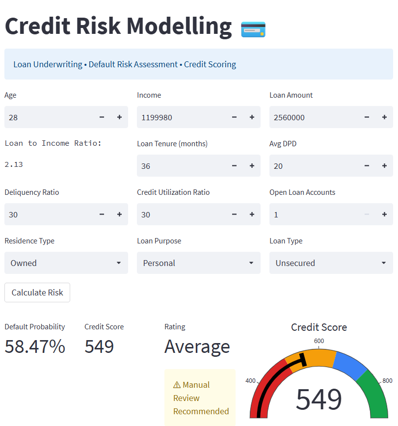

# 🏦 Credit Risk Assessment Platform

An end-to-end Machine Learning solution for predicting loan default risk and assessing borrower creditworthiness.

## 📷 Application Preview



---

## 🚀 Live Demo

**Streamlit Application:**  
https://ml-project02-credit-risk-modelling.streamlit.app/

---

## 📌 Business Problem

Financial institutions and NBFCs face significant challenges in minimizing losses caused by borrower defaults.

This project aims to:

- Predict the probability of loan default
- Assess borrower creditworthiness
- Categorize borrowers into risk tiers
- Support smarter lending decisions
- Reduce overall credit risk exposure

---

## 📊 Dataset Information

**Source:** Kaggle

**Dataset Size:**

- 50,000 Records
- 32 Features

**Target Variable:**

- Loan Default

---

## 🔍 Features Used

### Borrower Information

- Age
- Gender
- Marital Status
- Employment Status
- Income
- Number of Dependants
- Residence Type

### Geographic Information

- City
- State
- Zipcode

### Loan Information

- Loan Purpose
- Loan Type
- Loan Amount
- Sanction Amount
- Processing Fee
- Loan Tenure
- Net Disbursement

### Credit Behaviour Indicators

- Number of Open Accounts
- Number of Closed Accounts
- Principal Outstanding
- Delinquent Months
- Total DPD (Days Past Due)
- Credit Utilization Ratio
- Enquiry Count

---

## ⚙️ Machine Learning Pipeline

### Models Evaluated

- Logistic Regression
- Random Forest Classifier
- XGBoost Classifier

### Final Model Selected

**XGBoost Classifier**

XGBoost was selected as the final model because it consistently outperformed baseline models by effectively capturing complex non-linear relationships between borrower attributes, loan characteristics, and historical credit behaviour.

---

## 🛠️ Model Development

- Data Cleaning & Preprocessing
- Feature Engineering
- Feature Selection
- Hyperparameter Tuning
- Cross Validation
- SMOTE-Based Class Imbalance Handling
- Model Evaluation & Error Analysis

---

## 📈 Model Evaluation

The model was evaluated using:

- Accuracy
- Precision
- Recall
- F1 Score
- ROC-AUC

---

## 💳 Credit Scoring & Risk Segmentation

### 1. Default Probability

Predicts the likelihood that a borrower will default on the loan.

Example:

```text
Default Probability: 66.65%
```

### 2. Credit Score

The predicted probability is transformed into a credit score ranging from **300–900**, where higher scores indicate lower credit risk.

Example:

```text
Credit Score: 500
```

### 3. Risk Rating

| Credit Score Range | Rating |
|-------------------|---------|
| 300 – 499 | Poor |
| 500 – 649 | Average |
| 650 – 749 | Good |
| 750 – 900 | Excellent |

Example:

```text
Rating: Average
```

---

## 🖥️ Streamlit Application

### Inputs

- Age
- Income
- Loan Amount
- Loan Tenure
- Average DPD
- Delinquency Ratio
- Credit Utilization Ratio
- Number of Open Loan Accounts
- Residence Type
- Loan Purpose
- Loan Type

### Outputs

- Default Probability
- Credit Score
- Risk Rating
- Interactive Credit Score Gauge
- Underwriting Recommendation

---

## 🎯 Business Decision Layer

Examples:

- 🚫 High Risk Borrower
- ⚠ Manual Review Recommended
- ✓ Eligible for Standard Review
- ✅ Approval Recommended

---

## 🏗️ Project Structure

```text
.
├── artifacts/
├── assests/
│   └── Credit Risk-App-snap.png
├── main.py
├── prediction_helper.py
├── requirements.txt
├── README.md
└── LICENSE
```

---

## 🔧 Technology Stack

- Python
- Pandas
- NumPy
- Scikit-Learn
- XGBoost
- Imbalanced-Learn (SMOTE)
- Plotly
- Streamlit
- Joblib

---

## ✨ Key Highlights

- End-to-End Machine Learning Pipeline
- Credit Risk Classification
- Class Imbalance Handling using SMOTE
- Probability-Based Credit Scoring
- Risk Tier Segmentation
- Interactive Credit Score Gauge
- Business-Oriented Underwriting Recommendations
- Streamlit Cloud Deployment

---

## 👨‍💻 Author

**Himanshu K**
